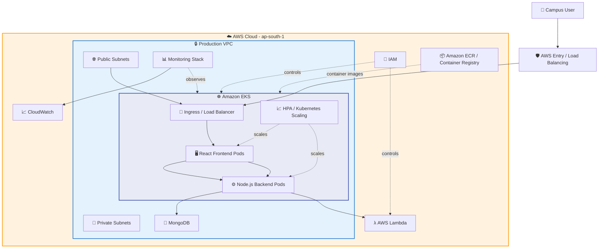
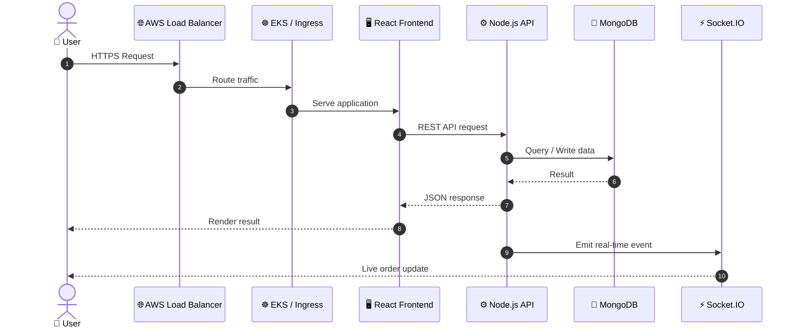
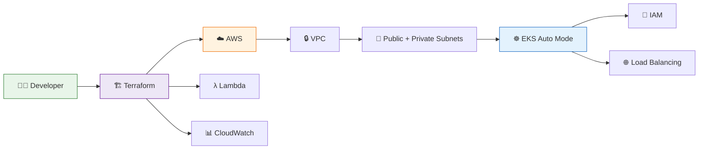
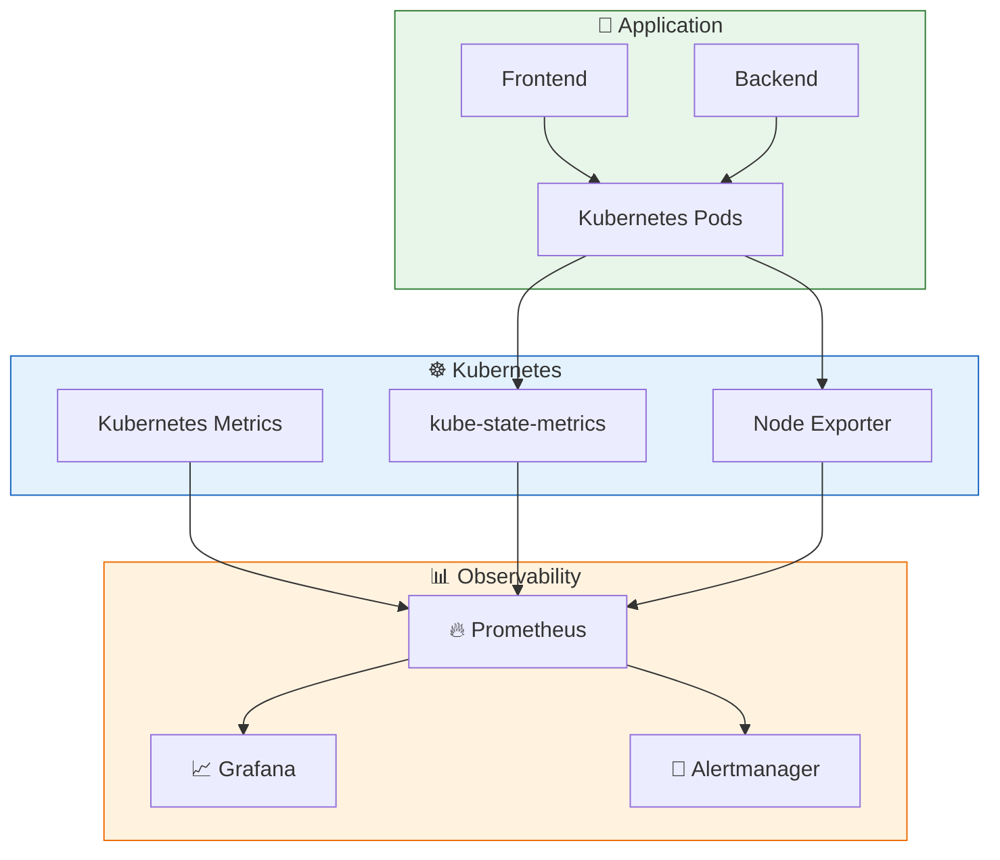
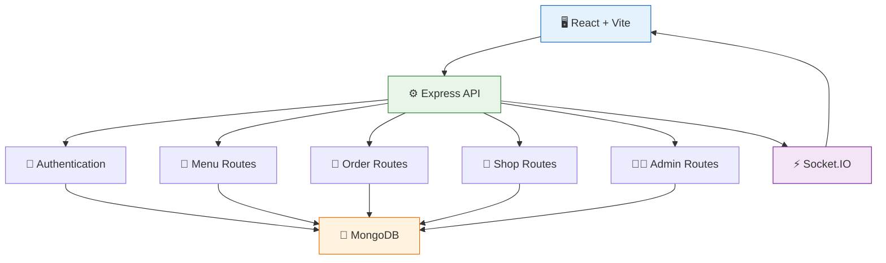
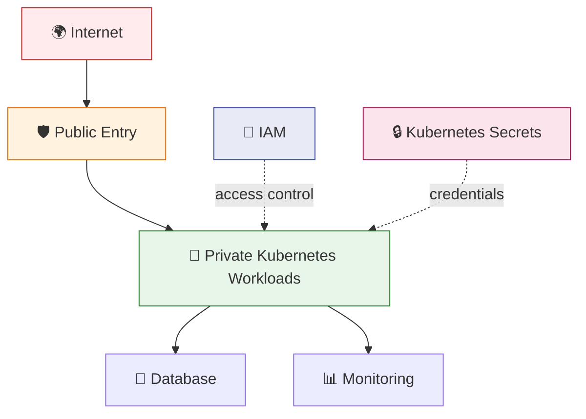
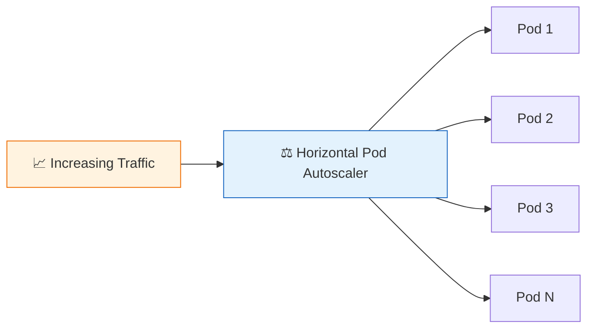
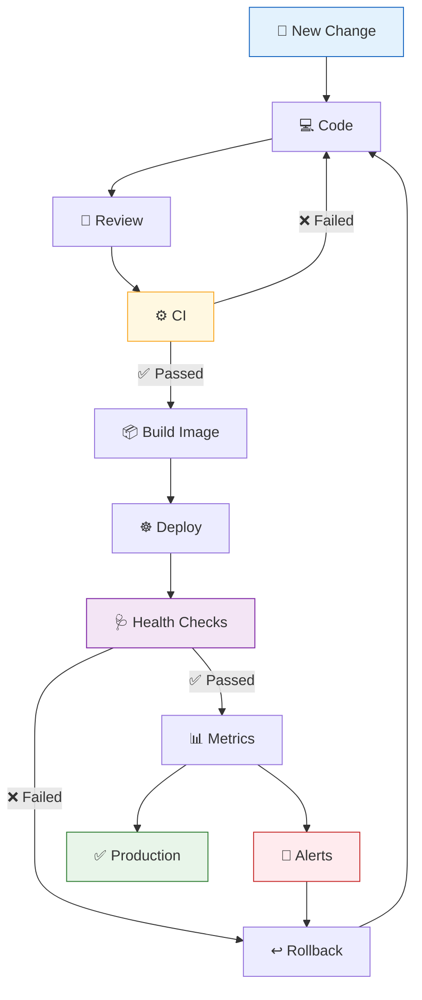

# 🚀 Campus Mess Ordering System

<p align="center">
  
  
  
  
  
  
  
</p>

<p align="center">
  <b>A cloud-native campus food ordering platform engineered around Kubernetes, Infrastructure as Code, observability, automation, and scalable deployment.</b>
</p>

---

## 📌 Table of Contents

- [🎯 Project Overview](#-project-overview)
- [🏗️ Production Architecture](#️-production-architecture)
- [🔄 End-to-End Request Flow](#-end-to-end-request-flow)
- [☁️ AWS Infrastructure Flow](#️-aws-infrastructure-flow)
- [⚙️ CI/CD Workflow](#️-cicd-workflow)
- [📊 Observability Architecture](#-observability-architecture)
- [🧩 Application Architecture](#-application-architecture)
- [📁 Repository Structure](#-repository-structure)
- [🛠️ Technology Stack](#️-technology-stack)
- [🔐 Security Model](#-security-model)
- [🚀 Deployment Workflow](#-deployment-workflow)
- [🧪 Validation & Health Checks](#-validation--health-checks)
- [📈 Scaling Strategy](#-scaling-strategy)
- [🚨 Monitoring & Alerting](#-monitoring--alerting)
- [💾 Storage Strategy](#-storage-strategy)
- [🧹 Infrastructure Teardown](#-infrastructure-teardown)
- [💰 Cost Awareness](#-cost-awareness)
- [🧠 Engineering Decisions](#-engineering-decisions)
- [🗺️ Production Roadmap](#️-production-roadmap)

---

# 🎯 Project Overview

**Campus Mess Ordering System** is a full-stack food ordering platform designed for a college/campus environment.

The platform supports:

- 👤 User authentication
- 🍱 Menu management
- 🛒 Food ordering
- 🏪 Shop management
- 👨‍💼 Admin operations
- ⚡ Real-time communication with Socket.IO
- 🗄️ MongoDB persistence
- ☁️ AWS cloud infrastructure
- ☸️ Kubernetes orchestration
- 📦 Containerized application workloads
- 🏗️ Terraform-based infrastructure provisioning
- 📊 Prometheus/Grafana observability
- 🚨 Alerting and operational monitoring
- ⚙️ Lambda-based serverless workloads

The infrastructure is designed so the application layer and infrastructure layer remain separated:

```text
Application
    ↓
Containers
    ↓
Kubernetes / EKS
    ↓
AWS Networking & Compute
    ↓
Terraform
```

---

# 🏗️ Production Architecture

## 🌐 High-Level Architecture



> **Note:** The architecture diagram describes the intended production topology. Exact deployed resources are determined by the Terraform configuration in `terraform/`.

---

# 🔄 End-to-End Request Flow

A typical user request follows this path:



---

# ☁️ AWS Infrastructure Flow

Terraform is responsible for provisioning the infrastructure.



---

# ⚙️ CI/CD Workflow

The intended delivery model follows a Git-driven workflow:

```mermaid
flowchart LR

    CODE["💻 Developer"]
    GIT["🐙 GitHub"]
    CI["🔍 CI"]
    BUILD["🔨 Build"]
    TEST["🧪 Test"]
    IMAGE["📦 Container Image"]
    REG["☁️ Registry"]
    DEPLOY["🚀 Kubernetes Deployment"]
    EKS["☸️ EKS"]
    MON["📊 Monitoring"]

    CODE --> GIT
    GIT --> CI
    CI --> BUILD
    BUILD --> TEST
    TEST --> IMAGE
    IMAGE --> REG
    REG --> DEPLOY
    DEPLOY --> EKS
    EKS --> MON

    style CODE fill:#e8f5e9,stroke:#2e7d32
    style GIT fill:#f5f5f5,stroke:#333
    style CI fill:#fff8e1,stroke:#f9a825
    style EKS fill:#e3f2fd,stroke:#1565c0
    style MON fill:#ffebee,stroke:#c62828
```



### Deployment philosophy

```text
CODE
  │
  ▼
COMMIT
  │
  ▼
CI VALIDATION
  │
  ├── ❌ FAIL → Fix → Commit again
  │
  ▼
BUILD
  │
  ▼
CONTAINER IMAGE
  │
  ▼
REGISTRY
  │
  ▼
KUBERNETES
  │
  ▼
HEALTH CHECK
  │
  ▼
PROMETHEUS
  │
  ▼
GRAFANA
```

---

# 📊 Observability Architecture

Monitoring is treated as a separate operational layer.



### Monitoring signals

| Signal | Purpose |
|---|---|
| CPU | Detect compute pressure |
| Memory | Detect memory pressure |
| Pod status | Detect failed workloads |
| Restart count | Detect unstable containers |
| Node health | Detect infrastructure issues |
| API availability | Detect application outages |
| Request metrics | Understand traffic |
| Kubernetes state | Understand cluster health |
| Alert rules | Proactively detect incidents |

---

# 🧩 Application Architecture



---

# 📁 Repository Structure

```text
Mess-ordering-system/
│
├── backend/
│   ├── middleware/
│   │   └── auth.js
│   │
│   ├── models/
│   │   ├── MenuItem.js
│   │   ├── Order.js
│   │   ├── Shop.js
│   │   └── User.js
│   │
│   ├── routes/
│   │   ├── admin.js
│   │   ├── auth.js
│   │   ├── menu.js
│   │   ├── orders.js
│   │   └── shops.js
│   │
│   ├── server.js
│   ├── package.json
│   ├── package-lock.json
│   └── Dockerfile
│
├── frontend/
│   ├── src/
│   ├── public/
│   ├── package.json
│   └── Dockerfile
│
├── terraform/
│   ├── provider.tf
│   ├── versions.tf
│   ├── variables.tf
│   ├── vpc.tf
│   ├── eks.tf
│   ├── lambda.tf
│   ├── monitoring.tf
│   └── outputs.tf
│
├── k8s/
│   ├── backend/
│   ├── frontend/
│   ├── mongodb/
│   ├── ingress/
│   └── namespace.yaml
│
├── .github/
│   └── workflows/
│
├── docker-compose.yml
├── README.md
└── .gitignore
```

---

# 🛠️ Technology Stack

## Frontend

- React
- Vite
- Axios
- Tailwind CSS
- Socket.IO Client

## Backend

- Node.js
- Express
- MongoDB / Mongoose
- JWT
- bcryptjs
- CORS
- Socket.IO
- dotenv

## Containers

- Docker
- Dockerfile-based application builds
- Container registry

## Cloud

- AWS
- Amazon VPC
- Amazon EKS
- EKS Auto Mode
- AWS Lambda
- IAM
- Load Balancing
- CloudWatch

## Infrastructure as Code

- Terraform
- Terraform AWS provider
- Terraform Kubernetes provider
- Terraform Helm provider

## Kubernetes

- Amazon EKS
- Kubernetes Deployments
- Services
- Ingress
- HPA
- Persistent Volumes / Claims
- Secrets
- Namespaces

## Observability

- Prometheus
- Grafana
- Alertmanager
- kube-state-metrics
- Node Exporter

---

# 🔐 Security Model

The infrastructure follows a defense-in-depth approach.



### Security principles

- 🔐 Never commit `.env` files.
- 🔐 Never hard-code cloud credentials.
- 🔑 Use IAM instead of static AWS credentials where possible.
- 🧱 Keep workloads in private networking where practical.
- 🌐 Expose only required public endpoints.
- 🪪 Use Kubernetes RBAC.
- 🔒 Store application secrets outside source code.
- 📋 Keep Terraform state protected.
- 🔍 Monitor authentication and infrastructure events.

---

# 🚀 Deployment Workflow

## 1️⃣ Clone repository

```bash
git clone <YOUR_REPOSITORY_URL>
cd Mess-ordering-system
```

## 2️⃣ Configure AWS

```bash
aws configure
```

Verify:

```bash
aws sts get-caller-identity
```

---

## 3️⃣ Initialize Terraform

```bash
cd terraform

terraform init
```

---

## 4️⃣ Validate

```bash
terraform fmt -recursive
terraform validate
```

---

## 5️⃣ Review infrastructure

```bash
terraform plan
```

Never blindly apply infrastructure changes.

Review:

```text
Resources to add
Resources to change
Resources to destroy
```

---

## 6️⃣ Provision

```bash
terraform apply
```

Confirm when prompted.

---

## 7️⃣ Configure kubectl

After EKS creation:

```bash
aws eks update-kubeconfig \
  --region ap-south-1 \
  --name mess-ordering-eks
```

Verify:

```bash
kubectl get nodes
```

---

## 8️⃣ Verify cluster

```bash
kubectl get nodes
kubectl get pods -A
kubectl get svc -A
```

---

# 🧪 Validation & Health Checks

## Kubernetes

```bash
kubectl get nodes
kubectl get pods -A
kubectl get svc -A
```

## Application

```bash
kubectl get pods -n <namespace>
kubectl describe pod <pod-name> -n <namespace>
kubectl logs <pod-name> -n <namespace>
```

## Terraform

```bash
terraform validate
terraform plan
terraform output
```

## AWS

```bash
aws sts get-caller-identity

aws eks describe-cluster \
  --name mess-ordering-eks \
  --region ap-south-1
```

---

# 📈 Scaling Strategy

The platform is designed around horizontal scaling.



Scaling can be based on:

- CPU utilization
- Memory utilization
- Custom metrics
- Application traffic
- Kubernetes workload requirements

---

# 🚨 Monitoring & Alerting

Prometheus collects metrics.

Grafana visualizes metrics.

Alertmanager handles alert routing.

```text
Kubernetes
    │
    ├── Node Exporter
    │
    ├── kube-state-metrics
    │
    └── Kubernetes metrics
            │
            ▼
       Prometheus
        /       \
       ▼         ▼
   Grafana    Alertmanager
       │         │
       ▼         ▼
 Dashboards    Alerts
```

Recommended production alerts:

| Alert | Severity |
|---|---|
| Node unavailable | 🔴 Critical |
| Pod crash loop | 🔴 Critical |
| High CPU | 🟠 Warning |
| High memory | 🟠 Warning |
| Disk pressure | 🔴 Critical |
| API unavailable | 🔴 Critical |
| High restart count | 🟠 Warning |
| PersistentVolume failure | 🔴 Critical |

---

# 💾 Storage Strategy

The monitoring layer may require persistent storage for:

- Prometheus time-series data
- Grafana data
- Alertmanager state

Production deployments should use an AWS-backed Kubernetes storage class such as EBS-backed storage.

Example:

```yaml
storageClassName: gp3
```

Before relying on a storage class, verify:

```bash
kubectl get storageclass
```

---

# 🧹 Infrastructure Teardown

⚠️ **WARNING:** This destroys Terraform-managed infrastructure.

First inspect:

```bash
terraform plan -destroy
```

Then:

```bash
terraform destroy
```

Confirm only after verifying the destroy plan.

---

# 💰 Cost Awareness

AWS infrastructure can generate charges even when application traffic is low.

Always monitor:

- EKS control-plane charges
- Compute resources
- Load Balancers
- EBS volumes
- NAT Gateway
- CloudWatch
- Lambda invocations
- Data transfer
- Public IPv4 resources

For temporary development environments:

```bash
terraform destroy
```

should be part of the shutdown workflow.

---

# 🧠 Engineering Decisions

## Why Terraform?

Infrastructure becomes:

- Reproducible
- Version controlled
- Reviewable
- Automatable
- Easier to destroy and recreate

## Why EKS?

EKS provides managed Kubernetes control-plane operations while allowing the project to use standard Kubernetes workloads and tooling.

## Why EKS Auto Mode?

Auto Mode reduces the operational burden of managing worker-node infrastructure and lets the platform focus more on workloads.

## Why Helm?

Helm provides repeatable Kubernetes application packaging.

The monitoring stack can be managed declaratively through Terraform's Helm provider.

## Why Prometheus + Grafana?

Prometheus provides metrics collection and querying.

Grafana provides dashboards and operational visibility.

## Why Socket.IO?

The ordering platform can push real-time events such as order-status updates without requiring constant client polling.

---

# 🗺️ Production Roadmap

```mermaid
flowchart LR

    P1["✅ Application"]
    P2["✅ Docker"]
    P3["✅ Terraform"]
    P4["✅ AWS VPC"]
    P5["✅ EKS"]
    P6["📊 Observability"]
    P7["🚨 Alerting"]
    P8["🔐 Security Hardening"]
    P9["⚙️ CI/CD"]
    P10["🌍 Production Domain"]
    P11["🔒 HTTPS"]
    P12["📈 Advanced Autoscaling"]

    P1 --> P2
    P2 --> P3
    P3 --> P4
    P4 --> P5
    P5 --> P6
    P6 --> P7
    P7 --> P8
    P8 --> P9
    P9 --> P10
    P10 --> P11
    P11 --> P12

    style P1 fill:#e8f5e9,stroke:#2e7d32
    style P2 fill:#e8f5e9,stroke:#2e7d32
    style P3 fill:#e8f5e9,stroke:#2e7d32
    style P4 fill:#e8f5e9,stroke:#2e7d32
    style P5 fill:#e8f5e9,stroke:#2e7d32
    style P6 fill:#fff3e0,stroke:#ef6c00
    style P7 fill:#fff3e0,stroke:#ef6c00
```



---

# 🏆 Production Readiness Checklist

### Infrastructure

- [ ] Terraform state protected
- [ ] AWS credentials not committed
- [ ] VPC correctly segmented
- [ ] Private workloads configured
- [ ] EKS access controlled
- [ ] IAM permissions reviewed

### Application

- [ ] Backend health endpoint
- [ ] Frontend health checks
- [ ] Kubernetes readiness probes
- [ ] Kubernetes liveness probes
- [ ] Resource requests
- [ ] Resource limits
- [ ] Graceful shutdown

### Security

- [ ] Secrets externalized
- [ ] HTTPS enabled
- [ ] RBAC reviewed
- [ ] Least-privilege IAM
- [ ] Network exposure reviewed
- [ ] Dependency vulnerabilities scanned

### Observability

- [ ] Prometheus running
- [ ] Grafana running
- [ ] Alertmanager running
- [ ] Node metrics available
- [ ] Kubernetes metrics available
- [ ] Application metrics available
- [ ] Alerts tested

### Reliability

- [ ] Multiple replicas where required
- [ ] HPA configured
- [ ] Pod disruption strategy
- [ ] Persistent storage tested
- [ ] Backup strategy
- [ ] Recovery procedure documented

### Delivery

- [ ] CI pipeline
- [ ] Automated tests
- [ ] Image scanning
- [ ] Immutable image tags
- [ ] Deployment strategy
- [ ] Rollback procedure

---

# 🔁 Operational Workflow



---

# 👨‍💻 Developer Workflow

```bash
# Clone
git clone <YOUR_REPOSITORY_URL>

# Enter project
cd Mess-ordering-system

# Check status
git status

# Create branch
git checkout -b feature/<feature-name>

# Make changes
# ...

# Validate Terraform
cd terraform
terraform fmt -recursive
terraform validate
terraform plan

# Commit
git add .
git commit -m "feat: <description>"

# Push
git push origin feature/<feature-name>
```

---

# 📌 Important Operational Rule

> **Terraform is the source of truth for infrastructure.**

Avoid manually creating infrastructure resources that Terraform is expected to manage.

Recommended workflow:

```text
Git
 ↓
Terraform
 ↓
AWS
 ↓
EKS
 ↓
Helm / Kubernetes
 ↓
Application
 ↓
Observability
```

This keeps the environment reproducible and prevents configuration drift.

---

# ⭐ Project Philosophy

The goal of this project is not simply to deploy a Node.js application.

The goal is to demonstrate an engineering workflow around:

```text
Application Engineering
        +
Containerization
        +
Infrastructure as Code
        +
Cloud Architecture
        +
Kubernetes
        +
Observability
        +
Automation
        +
Security
        +
Reliability
```

**Build it → automate it → observe it → scale it → secure it → recover it.**

---

<p align="center">
  <b>☁️ Built for AWS • ☸️ Orchestrated with Kubernetes • 🏗️ Provisioned with Terraform • 📊 Observed with Prometheus & Grafana</b>
</p>
